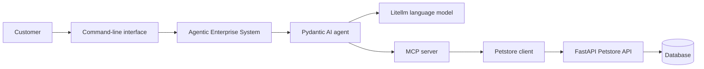

# Agentic Petstore Onboarding Project

> **Audience:** Python developers with basic Docker experience and no previous agentic-AI experience  
> **Final product:** A conversational command-line Petstore where a customer can browse, inspect, and buy a pet  
> **Core technologies:** Pydantic, Pydantic AI, Litellm, MCP, FastAPI, UV, Docker, a database, and the Agentic Enterprise System (AES)

---

## Table of contents

1. [Project overview](#1-project-overview)
2. [Why this project exists](#2-why-this-project-exists)
3. [The final customer experience](#3-the-final-customer-experience)
4. [What is already provided](#4-what-is-already-provided)
5. [What you will build](#5-what-you-will-build)
6. [How the system fits together](#6-how-the-system-fits-together)
7. [Pet information and validation rules](#7-pet-information-and-validation-rules)
8. [Searching for pets](#8-searching-for-pets)
9. [Buying a pet](#9-buying-a-pet)
10. [The role of the agent](#10-the-role-of-the-agent)
11. [The role of the MCP server](#11-the-role-of-the-mcp-server)
12. [Step-by-step project journey](#12-step-by-step-project-journey)
13. [Required customer journeys](#13-required-customer-journeys)
14. [Example dialogue](#14-example-dialogue)
15. [Suggested store inventory](#15-suggested-store-inventory)
16. [Docker and project operation](#16-docker-and-project-operation)
17. [Expected project structure](#17-expected-project-structure)
18. [Deliverables](#18-deliverables)
19. [Definition of done](#19-definition-of-done)
20. [Review criteria](#20-review-criteria)
21. [Out of scope](#21-out-of-scope)
22. [Glossary](#22-glossary)

---

## 1. Project overview

In this onboarding project, you will turn an existing Petstore API into a small agentic application.

The finished application will be a command-line conversation in which a customer can:

- Ask which pets are available.
- Search for pets using normal language.
- View the details of a particular pet.
- Compare a small number of pets.
- Select a pet they would like to buy.
- Review and confirm the purchase.
- Receive a clear purchase confirmation or failure explanation.

The application will use an AI agent to understand what the customer wants and to select an approved Petstore action. The agent must not invent pets, prices, availability, or purchase results. All store information must come from the Petstore application.

This is a fictional store. No real animals, payments, deliveries, or customer accounts are involved.

### Project objective

Build a reliable Petstore assistant that feels conversational while remaining controlled by normal application rules.

> **Guiding principle:** The language model may interpret a customer request, but the application remains responsible for facts, validation, availability, and purchases.

---

## 2. Why this project exists

This project introduces agentic AI through a familiar software-development problem.

You are not expected to know how language models are trained. Instead, you will learn how a language model can work with a normal Python application through clearly defined actions.

By completing the project, you should understand:

- The difference between a conversational agent and normal application logic.
- Why structured data and validation still matter when an LLM is involved.
- How an agent can use a limited set of business actions.
- Why an agent should not receive unrestricted access to systems or data.
- Why important actions, such as a purchase, require explicit customer confirmation.
- How an agentic application can be split into separately operated services.
- How the complete solution can be run consistently with Docker and UV.

### What the agent is allowed to decide

The agent may decide that a customer request means:

- Search for cats.
- Show pets below a certain price.
- Retrieve more information about one pet.
- Ask the customer which pet they meant.
- Prepare a purchase for confirmation.

### What the agent is not allowed to decide

The agent may not decide:

- Whether pet data is valid.
- What a pet costs.
- Whether a pet is available.
- Whether a purchase is permitted.
- Whether a purchase succeeded.
- What order number was created.

Those outcomes must come from the validated application and the Petstore API.

---

## 3. The final customer experience

The completed command-line application should feel like a small Petstore employee helping a customer.

A typical journey is:

1. The customer starts the CLI.
2. The assistant welcomes the customer and explains what it can do.
3. The customer describes the type of pet they are looking for.
4. The assistant searches the store and shows matching pets.
5. The customer chooses one pet and asks for more information.
6. The assistant retrieves and presents the latest pet details.
7. The customer says they would like to buy the pet.
8. The assistant shows the pet name and current price.
9. The assistant asks the customer to confirm the purchase.
10. After explicit confirmation, the application attempts the purchase.
11. The customer receives a receipt or a clear explanation of why the purchase failed.
12. The customer can continue browsing or leave the store.

The experience should be understandable to someone who knows nothing about APIs, MCP, language models, or Docker.

---

## 4. What is already provided

The following materials are available at the start of the project:

### Existing FastAPI project

A beginner FastAPI Petstore project is already available. It provides the starting API that the new components will use.

You should treat the existing API as the store’s source of truth. Do not replace it with information generated by the agent.

### Framework documentation

Documentation is provided for the main frameworks and platforms used in the project.

Use the supplied documentation as the primary guide for organization-specific conventions, especially for AES.

### Litellm access

An Litellm project key will be provided by **Merijn**.

Request this key before beginning the agent-integration stage.

The key is a secret and must never appear in:

- Source code.
- Version control.
- Docker images.
- Documentation examples.
- Screenshots.
- Logs.
- Customer-facing error messages.

### Agentic Enterprise System documentation

Internal documentation for the **Agentic Enterprise System (AES)** is provided.

AES should be used as the operational home of the agent. Its exact setup and conventions must follow the supplied internal documentation.

### Reference project

The Swagger Petstore repository can be used as a functional reference for common Petstore concepts:

- <https://github.com/swagger-api/swagger-petstore>

The supplied FastAPI project remains the actual starting point for this assignment.

---

## 5. What you will build

The complete project contains the following parts:

| Part | Purpose |
|---|---|
| **Petstore FastAPI application (given)** | Provides the store operations and remains the source of truth. |
| **Database (given)** | Stores pets, availability, and purchase information. |
| **Pydantic domain models (given)** | Describe valid pets, searches, purchase requests, and purchase results. |
| **Petstore client (given)** | Gives the new application one clear way to communicate with the FastAPI API. |
| **MCP server** | Exposes a small set of approved Petstore actions to the agent. |
| **Pydantic AI agent** | Understands the conversation and selects approved actions. |
| **Litellm connection** | Provides access to the language model used by the agent. |
| **AES-hosted agent service** | Hosts and operates the agent according to the organization’s conventions. |
| **CLI** | Provides the customer-facing conversation. |
| **Docker environment** | Runs all project-owned runtime components together. |
| **UV project setup** | Manages the Python environments and reproducible dependencies. |

### Required technology choices

The following choices are part of the assignment and should not be replaced:

- Use **Pydantic** for the domain models and validators.
- Use **Pydantic AI** for the agent.
- Use **Litellm** to access the language model.
- Use **MCP** to provide Petstore actions to the agent.
- Host and operate the agent through **AES**.
- Use **UV** for new Python project and dependency management.
- Run the project-owned services with **Docker**.
- Use a containerized **database** for persistent store information.

Litellm is an external service and does not run inside the project’s Docker environment.

---

## 6. How the system fits together

The main flow is:

**Customer → CLI → AES → Pydantic AI agent → MCP server → Petstore client → FastAPI Petstore API → database**

Litellm supplies the language model used by the agent.

### Responsibility of each part

| Part | Main responsibility |
|---|---|
| **CLI** | Holds the dialogue with the customer. |
| **AES** | Hosts and operates the agent. |
| **Pydantic AI agent** | Interprets the customer’s request and selects an approved action. |
| **Litellm** | Provides access to the selected language model. |
| **MCP server** | Presents a controlled set of Petstore capabilities. |
| **Petstore client** | Communicates with the existing FastAPI application. |
| **FastAPI application** | Performs store operations and enforces store workflow. |
| **Database** | Persists pets, status changes, and purchases. |

### Required boundaries

- The CLI communicates with the agent through AES.
- The CLI does not communicate directly with the database.
- The agent uses the MCP server for Petstore actions.
- The agent does not access the database directly.
- The MCP server uses the Petstore client.
- The Petstore client communicates with the FastAPI API.
- The FastAPI application is the only component that directly controls Petstore data in the database.

These boundaries are part of the learning objective. Do not bypass them simply because a shorter route appears possible.

---

## 7. Pet information and validation rules

A Petstore pet must contain enough information for a customer to compare pets and make a purchasing decision.

The project should define at least these validated concepts:

1. **Pet**
2. **Pet search criteria**
3. **Purchase request**
4. **Purchase result or receipt**

Additional concepts may be introduced when they make the project clearer.

### Minimum pet information

| Information | Required rule |
|---|---|
| **Pet identifier** | Must be a positive and unique value. |
| **Name** | Must contain between 2 and 50 characters after unnecessary whitespace is removed. |
| **Species** | Must be dog, cat, rabbit, bird, reptile, or other. |
| **Specific species** | Required when the general species is `other`. |
| **Breed** | Optional, but may not be blank when provided. |
| **Age** | Recorded in months and may not be negative. |
| **Weight** | Recorded in kilograms and must be greater than zero. |
| **Tail length** | Recorded in centimetres and must be at least **1 cm**. |
| **Description** | Must be meaningful and contain between 10 and 500 characters. |
| **Price** | Must be greater than zero and expressed in euros. |
| **Availability** | Must be available, pending, or sold. |
| **Tags** | May not contain blank or duplicate values. |
| **Photo reference** | At least one photo reference should be present, even though the CLI displays it as text. |

> **Training rule:** The minimum tail length of 1 cm is an intentionally simple validation exercise. It is not intended as a biological statement covering every possible animal.

### Types of validation to demonstrate

#### Single-value validation

Examples:

- A tail length of `0.5 cm` is invalid.
- A negative price is invalid.
- An empty name is invalid.
- A weight of zero is invalid.
- An unsupported availability value is invalid.

#### Related-value validation

Examples:

- A minimum price may not be greater than a maximum price.
- A minimum age may not be greater than a maximum age.
- A pet with species `other` must include a more specific species description.

#### State validation

Examples:

- Only an available pet can be bought.
- A pending pet cannot be sold to another customer.
- A sold pet must not appear as available.
- A successful purchase must change the pet’s status.

#### Normalization

Examples:

- Extra whitespace should not create a different pet name.
- Tags such as `Friendly` and `friendly` should be treated as duplicates.
- Empty search text should not be treated as a meaningful search filter.

### Customer-friendly validation messages

Invalid information should result in a clear explanation.

Good example:

> Tail length must be at least 1 cm.

Poor example:

> ValidationError at object index 0, field tail_length_cm, greater_than_equal...

Internal diagnostic information may be logged according to project conventions, but it should not be displayed directly to the customer.

---

## 8. Searching for pets

The customer should be able to search using one or more of the following characteristics:

- Species.
- Breed.
- Minimum age.
- Maximum age.
- Minimum price.
- Maximum price.
- Availability.
- Tags or characteristics.
- Part of the pet’s name.

### Example customer requests

The agent should understand requests such as:

- “Show me the available cats.”
- “Do you have a dog for less than €500?”
- “I am looking for a young rabbit.”
- “Which friendly pets are available?”
- “Tell me about Luna.”
- “Show me something smaller and cheaper.”
- “Are there any birds between €100 and €250?”

### Search behavior

- Search criteria must be validated before they are used.
- Results must come from the Petstore.
- Sold pets must not be presented as available.
- The agent should show a manageable list rather than an overwhelming amount of information.
- When no pet matches, the agent should say so clearly.
- The agent may suggest broadening the search, but it must not invent alternatives.
- When a request is ambiguous, the agent should ask one focused question instead of guessing.

### Follow-up requests

The agent should remember the current conversation well enough to understand references such as:

- “Tell me about the second one.”
- “Which of those is youngest?”
- “Show me the cheaper cat.”
- “Is she still available?”
- “I would like to buy that one.”

When more than one interpretation remains possible, the agent should ask the customer to clarify.

---

## 9. Buying a pet

Buying a pet represents a simulated store order. There is no real payment step.

### Required purchase journey

1. The customer selects one specific pet.
2. The latest pet details are retrieved.
3. The latest price and availability are checked.
4. The assistant presents the pet name, current price, and current availability.
5. The assistant asks the customer for explicit confirmation.
6. The purchase is attempted only after confirmation.
7. A successful purchase creates an order.
8. The pet becomes sold.
9. The result is saved in the database.
10. The customer receives a clear receipt or failure explanation.

### Confirmation requirement

The following statements are **not** sufficient confirmation:

- “That one looks nice.”
- “I think I like Luna.”
- “Maybe I will buy it.”
- “What happens if I buy it?”
- “That sounds good.”

The following statements are sufficiently clear:

- “Yes, buy Luna for €250.”
- “Confirm the purchase.”
- “Yes, place the order.”

A general “yes” should count only when the assistant has just asked the customer to confirm one clearly identified pet and price.

### Purchase safeguards

- The current price must come from the Petstore.
- The agent may not create or change a price.
- Availability must be checked again immediately before the purchase.
- A purchase must not continue when the customer cancels.
- A sold pet cannot be bought again.
- A failed purchase must not produce a false receipt.
- The assistant must never claim success until the Petstore confirms success.

---

## 10. The role of the agent

The agent should behave like a helpful Petstore employee.

### The agent should

- Welcome the customer.
- Briefly explain what it can do.
- Understand normal conversational requests.
- Use approved Petstore actions to search and retrieve information.
- Present a manageable list of results.
- Remember which pets were discussed during the current conversation.
- Understand simple follow-up references.
- Ask for clarification when needed.
- Ask for explicit purchase confirmation.
- Explain successful and failed outcomes clearly.
- Offer a relevant next action after completing a request.

### The agent must

- Use actual Petstore information.
- Recheck availability immediately before purchasing.
- State when it cannot reach the store.
- State when no pets match.
- Keep secrets and internal errors out of the dialogue.
- Respect the Pydantic validation rules.
- Respect Petstore business rules.
- Use the MCP server rather than bypassing it.

### The agent must not

- Invent pets.
- Invent prices.
- Invent identifiers or order numbers.
- Invent availability.
- Claim a purchase succeeded without a confirmed result.
- Buy a pet without explicit confirmation.
- Communicate directly with the database.
- Bypass the MCP server.
- Reveal the Litellm key.
- Pretend that an unavailable service is working.
- Perform administrative actions that are outside the customer journey.

### Expected tone

The assistant should be:

- Helpful.
- Clear.
- Calm.
- Concise.
- Honest about errors and limitations.

It should not overwhelm the customer with implementation details.

---

## 11. The role of the MCP server

The MCP server provides the agent with a small, controlled set of Petstore capabilities.

At minimum, the agent must be able to:

1. List or search pets.
2. Retrieve the details of one pet.
3. Check current availability.
4. Place a purchase order.
5. Retrieve or return the result of the purchase.

### Design expectations

- Each capability should have one understandable business purpose.
- Only actions required by the customer journey should be exposed.
- The purchase capability must not accept a price invented by the agent.
- The Petstore should determine the current price.
- MCP results should be understandable and structured.
- Store failures should be represented clearly enough for the agent to explain them honestly.

### Capabilities that must not be exposed

The MCP server must not provide:

- Arbitrary database access.
- Arbitrary file access.
- Arbitrary command execution.
- General-purpose HTTP requests.
- Unrestricted administrative Petstore operations.
- Access to secrets.

The goal is not to expose everything the system can do. The goal is to expose only what the customer journey requires.

---

## 12. Step-by-step project journey

Complete the project in the following order. Each step has a clear outcome. Do not move the agent to the center of the project before the normal application behavior is reliable.

### Step 1 — Explore the supplied Petstore

Start by using the existing FastAPI project as a normal Petstore application.

Understand:

- What pet information already exists.
- How pets are listed.
- How one pet is retrieved.
- How availability is represented.
- How an order is created.
- Which project requirements are not yet represented.

Do not redesign the supplied application unnecessarily. Make only the smallest changes needed to support the onboarding scenario.

**Outcome:** You can describe the complete non-agentic journey from viewing a pet to placing an order.

---

### Step 2 — Define the Petstore language and rules

Create the Pydantic models that represent:

- Pets.
- Search criteria.
- Purchase requests.
- Purchase results.

Apply the validation rules described in this assignment.

Include valid and invalid examples so that another developer can understand the boundaries.

The Pydantic layer must be responsible for data correctness. Do not rely on the language model to remember that prices must be positive or that tail length must be at least 1 cm.

**Outcome:** Invalid pet and purchase information is rejected consistently without involving an AI model.

---

### Step 3 — Create the Petstore client

Create one clear application boundary for communicating with the existing FastAPI project.

The rest of the new application should work with understandable Petstore concepts rather than raw API information.

Responses from the API should be checked before they are trusted.

Turn failures into clear application outcomes, including:

- Pet not found.
- Pet already sold.
- Invalid request.
- Store unavailable.
- Purchase unsuccessful.

**Outcome:** The new application can list, inspect, and buy pets through the API without using an LLM.

---

### Step 4 — Create the MCP server

Place the required Petstore actions behind an MCP server.

Present the store as a small collection of safe, business-focused capabilities.

Verify these capabilities independently of the agent. The store actions must work predictably before a language model is allowed to select them.

**Outcome:** An MCP client can browse pets, inspect a pet, and place a controlled purchase through the Petstore client.

---

### Step 5 — Request and prepare Litellm access

Request the project Litellm key from **Merijn**.

Verify that the key is available to the running application without placing it in the repository or Docker image.

The application should provide a clear configuration message when the key is missing. It should never print the key.

The language model must be accessed through Litellm rather than through a separate direct provider connection.

**Outcome:** The project can access its selected language model through Litellm while keeping the credential private.

---

### Step 6 — Build the Pydantic AI agent

Create the Petstore assistant using Pydantic AI.

Give the agent:

- A clear Petstore role.
- Access to the approved MCP capabilities.
- Rules for factual responses.
- Rules for clarification.
- Rules for purchase confirmation.
- Clear boundaries for actions it may and may not perform.

Add behavior gradually:

1. List pets.
2. Filter pets.
3. Show one pet’s details.
4. Understand follow-up references.
5. Prepare a purchase.
6. Confirm and place a purchase.
7. Explain failures honestly.

**Outcome:** The agent can translate customer language into the correct Petstore action and explain the result.

---

### Step 7 — Host the agent in AES

Place the agent inside the supplied Agentic Enterprise System.

For this project, AES should act as the operational boundary around the agent. It should:

- Receive the customer’s message.
- Operate the Pydantic AI agent.
- Provide the configured connection to the MCP server.
- Return the final response.
- Follow supplied conventions for configuration, lifecycle, logging, and error handling.

The CLI should communicate through AES rather than creating or operating the agent directly.

**Outcome:** The Petstore agent runs as part of the organization’s normal agentic platform.

---

### Step 8 — Create the CLI dialogue

Create a small command-line customer experience.

The CLI should:

1. Display a welcome message.
2. Explain the available actions.
3. Accept a conversational request.
4. Show matching pets.
5. Display the details of a selected pet.
6. Offer the option to purchase.
7. Ask for explicit confirmation.
8. Display a receipt or failure explanation.
9. Allow the customer to continue or exit.

The CLI should display customer-friendly information only. It should not expose:

- Raw model responses.
- Internal tool messages.
- Validation traces.
- API response bodies.
- Secrets.

**Outcome:** A developer unfamiliar with the project can complete the customer journey without understanding the internal components.

---

### Step 9 — Place the complete system in Docker

Every runtime component owned by the project must run in Docker.

This includes at least:

- FastAPI Petstore application.
- Database.
- MCP server.
- AES-hosted agent.
- CLI.

The complete environment should have one documented startup journey. A developer should not have to start hidden Python processes manually on the host.

The database must retain purchases and pet availability changes after services restart.

Litellm remains external. Its key must be supplied to the environment at runtime and must not be stored in an image.

**Outcome:** A new developer can start the complete Petstore environment and begin a CLI conversation through one documented workflow.

---

### Step 10 — Make the project reproducible with UV

Use UV for all newly created Python project and dependency management.

The project should clearly identify its Python requirements and lock dependency versions so another developer receives the same environment.

Avoid mixing multiple Python dependency-management approaches unless the supplied starter project makes this unavoidable. When a difference remains, document it and keep all newly created components consistent.

**Outcome:** Another developer can recreate the Python environments from the project files without manually selecting package versions.

---

### Step 11 — Verify the complete customer journey

Run the application as one complete product rather than checking only the individual services.

Confirm that:

- The CLI reaches AES.
- AES operates the Pydantic AI agent.
- The agent reaches the MCP server.
- The MCP server reaches the Petstore API through the client.
- The API reads and writes the database.
- A successful purchase remains visible after a restart.

**Outcome:** The system behaves as one product from the customer’s perspective.

---

## 13. Required customer journeys

The completed project must demonstrate the following scenarios.

| Scenario | Expected behavior |
|---|---|
| **List available pets** | Only pets currently marked available are presented. |
| **Search by species** | The assistant returns pets of the requested species. |
| **Search by price** | The assistant respects the requested price boundaries. |
| **Combined search** | A request such as “young dogs under €500” is handled correctly. |
| **Search by characteristic** | Tags such as friendly or calm can be used. |
| **Follow-up reference** | The assistant understands “the second one” after showing a numbered list. |
| **Unknown pet** | The customer receives a clear not-found response. |
| **Empty result** | The assistant says no pets matched and does not invent alternatives. |
| **Invalid tail length** | A pet with a tail shorter than 1 cm is rejected. |
| **Boundary tail length** | A pet with a tail length of exactly 1 cm is accepted. |
| **Invalid price range** | A minimum price above the maximum price is rejected. |
| **Purchase without confirmation** | No order is created. |
| **Cancelled purchase** | The pet remains available and no order is created. |
| **Successful purchase** | An order is created and the pet becomes sold. |
| **Repeated purchase** | A sold pet cannot be purchased again. |
| **Changed availability** | The assistant reports that the pet is no longer available. |
| **Missing Litellm key** | The application gives a clear configuration message without exposing secret information. |
| **Petstore unavailable** | The assistant explains that it cannot verify inventory or complete a purchase. |
| **MCP server unavailable** | The assistant does not pretend that store actions succeeded. |
| **Restart** | Completed purchases and pet status changes remain stored. |

---

## 14. Example dialogue

### Successful journey

**Petstore Assistant**

> Welcome to the Petstore. I can help you browse available pets, view their details, or buy a pet. What are you looking for?

**Customer**

> I would like a cat that costs less than €300.

**Assistant**

> I found two available cats:
>
> 1. Luna — 2 years old — €250  
> 2. Milo — 10 months old — €285
>
> Which one would you like to know more about?

**Customer**

> Tell me about Luna.

**Assistant**

> Luna is a 2-year-old domestic shorthair. She weighs 4.1 kg, has a tail length of 27 cm, and is described as calm and friendly. Her current price is €250 and she is available.

**Customer**

> I would like to buy her.

**Assistant**

> You are about to buy Luna for €250. Shall I place the order?

**Customer**

> Yes, confirm the purchase.

**Assistant**

> Your purchase was successful. Order 1048 has been created for Luna at a total price of €250. Luna is now marked as sold.

### Availability changed before purchase

**Assistant**

> You are about to buy Luna for €250. Shall I place the order?

**Customer**

> Yes, confirm the purchase.

**Assistant**

> I could not complete the purchase because Luna is no longer available. No order was created.

### Customer cancels

**Assistant**

> You are about to buy Milo for €285. Shall I place the order?

**Customer**

> No, cancel it.

**Assistant**

> The purchase has been cancelled. No order was created, and Milo remains available.

### No matching pets

**Customer**

> Show me an available cat for less than €50.

**Assistant**

> I could not find an available cat below €50. You can increase the maximum price or search for another species.

### Store unavailable

**Customer**

> Is Luna still available?

**Assistant**

> I cannot currently reach the Petstore, so I am unable to verify Luna’s availability. Please try again after the store connection has been restored.

---

## 15. Suggested store inventory

Seed the store with enough variety to make searching meaningful.

Include at least:

- Two dogs.
- Two cats.
- One rabbit.
- One bird.
- One reptile or other species.
- Pets at different ages.
- Pets at different prices.
- Pets with several different tags.
- At least one pending pet.
- At least one sold pet.
- At least one valid pet with a tail length of exactly **1 cm**.

### Example inventory mix

| Name | Species | Example characteristics | Status |
|---|---|---|---|
| Luna | Cat | Calm, friendly | Available |
| Milo | Cat | Playful, young | Available |
| Max | Dog | Active, trained | Available |
| Bella | Dog | Gentle, family-friendly | Pending |
| Pip | Rabbit | Small, quiet | Available |
| Kiwi | Bird | Social, colourful | Available |
| Nova | Reptile | Calm, low-noise | Sold |

This table is illustrative. The final records must follow the project’s validation rules.

Invalid examples used for testing should not become normal inventory records.

---

## 16. Docker and project operation

The complete solution should operate as one Docker-based environment.

### Runtime expectations

- All project-owned services run in containers.
- Services use clear and consistent names.
- The full environment has one documented startup journey.
- The full environment has one documented shutdown journey.
- Service failures are visible and understandable.
- The database uses persistent storage.
- The Litellm key is supplied only at runtime.
- A new developer should not need to install and run separate hidden services manually.

### Minimum services

| Service | Required responsibility |
|---|---|
| **Petstore API** | Runs the supplied FastAPI application. |
| **Database** | Stores inventory, status, and purchase information. |
| **MCP server** | Exposes approved Petstore capabilities. |
| **AES agent service** | Hosts the Pydantic AI agent. |
| **CLI** | Provides the conversational customer experience. |

### Persistence expectation

After a successful purchase and a complete restart:

- The order still exists.
- The purchased pet is still marked sold.
- The pet does not reappear as available.

---

## 17. Expected project structure

The exact folder names may follow team conventions, but the responsibilities should remain easy to find.

A reviewer should be able to identify:

- The supplied FastAPI Petstore project.
- The Pydantic domain models.
- The Petstore client.
- The MCP server.
- The Pydantic AI agent.
- The AES integration.
- The CLI.
- The Docker configuration.
- The database setup.
- The automated checks.
- The project documentation.

The structure should communicate the system boundaries without requiring a reviewer to inspect every file.

---

## 18. Deliverables

### 18.1 Working application

A complete Docker-based system containing:

- Petstore FastAPI application.
- Database.
- Pydantic domain models.
- Petstore client.
- MCP server.
- AES-hosted Pydantic AI agent.
- Litellm connection.
- CLI.

### 18.2 README

The README should explain:

- The purpose of the project.
- What was provided.
- What was built.
- How to request the Litellm key from Merijn.
- How the system fits together.
- How to start the complete environment.
- How to stop the complete environment.
- How to open the CLI.
- Which customer actions are supported.
- The main pet validation rules.
- The purchase-confirmation rule.
- How to run project checks.
- Known limitations.

### 18.3 Architecture overview

Include a small diagram showing the relationship between:

- CLI.
- AES.
- Pydantic AI agent.
- Litellm.
- MCP server.
- Petstore client.
- FastAPI API.
- Database.

### 18.4 Domain rule overview

Document the required models and important rules, including:

- Minimum tail length.
- Valid species.
- Valid availability values.
- Positive-price requirement.
- Age and price search-range rules.
- Purchase-confirmation requirement.
- Sold-pet restriction.

### 18.5 Verification evidence

Provide automated checks, a documented demonstration, or both for the required customer journeys.

### 18.6 Example conversations

Include:

- One successful browse-and-buy journey.
- One cancelled purchase.
- One failed purchase or unavailable-service journey.

---

## 19. Definition of done

The onboarding project is complete when all items below are true.

### Domain and validation

- [ ] Pet information is represented with Pydantic.
- [ ] Search criteria are represented with Pydantic.
- [ ] Purchase requests and results are represented with Pydantic.
- [ ] Invalid pet data is rejected with understandable messages.
- [ ] Tail length values below 1 cm are rejected.
- [ ] A tail length of exactly 1 cm is accepted.
- [ ] Invalid age and price ranges are rejected.
- [ ] Status rules are enforced consistently.

### Petstore integration

- [ ] The supplied FastAPI project is used as the Petstore API.
- [ ] A dedicated Petstore client communicates with the API.
- [ ] API responses are validated before being trusted.
- [ ] Store failures become clear application outcomes.

### MCP

- [ ] The MCP server exposes only required Petstore actions.
- [ ] The MCP server uses the Petstore client.
- [ ] The MCP server does not expose unrestricted system access.
- [ ] The MCP capabilities work independently of the agent.

### Agent

- [ ] The agent is built with Pydantic AI.
- [ ] The language model is accessed through Litellm.
- [ ] Litellm access is requested from Merijn.
- [ ] The Litellm key is handled as a secret.
- [ ] The agent is hosted and operated through AES.
- [ ] The agent uses the MCP server for store actions.
- [ ] The agent does not invent Petstore information.
- [ ] The agent handles ambiguity by asking a focused question.
- [ ] The agent explains unavailable services honestly.

### CLI and purchase journey

- [ ] The CLI communicates through AES.
- [ ] The customer can list and search pets.
- [ ] The customer can view one pet’s details.
- [ ] The customer can use simple conversational follow-ups.
- [ ] The customer can buy an available pet.
- [ ] A purchase requires explicit confirmation.
- [ ] Availability is checked immediately before purchase.
- [ ] A cancelled purchase creates no order.
- [ ] A successful purchase creates a stored order.
- [ ] A successful purchase changes the pet to sold.
- [ ] A sold pet cannot be bought again.
- [ ] Customer messages do not expose internal traces or secrets.

### Operation and reproducibility

- [ ] All project-owned runtime components run in Docker.
- [ ] The database runs in Docker.
- [ ] The MCP server runs in Docker.
- [ ] The AES-hosted agent runs in Docker.
- [ ] The CLI runs in Docker.
- [ ] Database information survives a restart.
- [ ] UV is used consistently for the new Python components.
- [ ] Dependency versions are reproducible.
- [ ] The complete environment has one documented startup journey.
- [ ] A new developer can complete the example dialogue using only the project documentation.

---

## 20. Review criteria

Review the project in the following order.

### 1. Domain correctness

- Are invalid pets reliably rejected?
- Are search ranges validated?
- Are purchase state rules enforced?
- Are error messages understandable?

### 2. Store correctness

- Do the client and MCP capabilities work without depending on the LLM?
- Does the Petstore remain the source of truth?
- Are purchases persisted correctly?

### 3. Agent discipline

- Does the agent use only approved capabilities?
- Does it avoid inventing information?
- Does it ask for clarification instead of guessing?

### 4. Purchase safety

- Is explicit confirmation required?
- Is availability checked again before purchase?
- Does the assistant wait for a confirmed Petstore result before claiming success?

### 5. User experience

- Is the CLI dialogue understandable?
- Are lists and pet details easy to read?
- Are failures explained clearly without technical noise?

### 6. System separation

- Does each component stay within its intended responsibility?
- Does the agent use MCP?
- Does the MCP server use the client?
- Does the CLI use AES?

### 7. Reproducibility

- Can another developer recreate the environment with Docker and UV?
- Are secrets excluded from the repository and images?
- Does stored information survive restarts?

### 8. Resilience

- Are missing keys handled clearly?
- Are unavailable services handled honestly?
- Are stale availability and repeated purchase attempts handled safely?

> A simple and predictable agent that always respects Petstore rules is better than a sophisticated conversational agent that occasionally invents information or performs an unsafe action.

---

## 21. Out of scope

To keep the onboarding project focused, the following are not required:

- A web interface.
- A mobile application.
- Real payment processing.
- Customer authentication.
- Customer account management.
- Real delivery or shipping.
- Production cloud deployment.
- Training or fine-tuning a language model.
- A multi-agent architecture.
- General internet access for the agent.
- Recommendations based on personal customer data.
- Administrative inventory management through the customer CLI.
- Replacing or substantially redesigning the supplied FastAPI project.

---

## 22. Glossary

| Term | Meaning in this project |
|---|---|
| **Agent** | The conversational application component that interprets the customer request and selects an approved action. |
| **Agentic AI** | An application pattern in which a language model can choose from controlled actions to work toward a user’s goal. |
| **AES** | The Agentic Enterprise System used to host and operate the agent. |
| **CLI** | The command-line interface used by the customer. |
| **FastAPI** | The framework used by the supplied Petstore API. |
| **LLM** | The language model that helps interpret the customer’s words. |
| **MCP** | The mechanism used to expose a limited set of Petstore capabilities to the agent. |
| **Litellm** | The service used to access the language model. |
| **Pydantic** | The library used to describe and validate structured Petstore information. |
| **Pydantic AI** | The framework used to build the agent. |
| **Petstore client** | The component that communicates with the existing FastAPI Petstore API. |
| **Source of truth** | The authoritative place from which a fact must be retrieved. In this project, store facts come from the Petstore application and database. |
| **UV** | The tool used to manage the Python projects and reproducible dependencies. |

---

## Final project statement

Create a Docker-hosted Agentic Petstore in which a customer can use a command-line conversation to browse, inspect, and buy a pet. Use Pydantic to define and validate store information, including a minimum tail length of 1 cm. Build the assistant with Pydantic AI, access the language model through Litellm using a key requested from Merijn, expose controlled Petstore actions through an MCP server, and host the agent through AES. Use the supplied FastAPI project as the Petstore API, persist store information in a database, and manage the Python projects with UV.

The completed application should feel conversational to the customer while remaining predictable, validated, and controlled by normal application rules.
